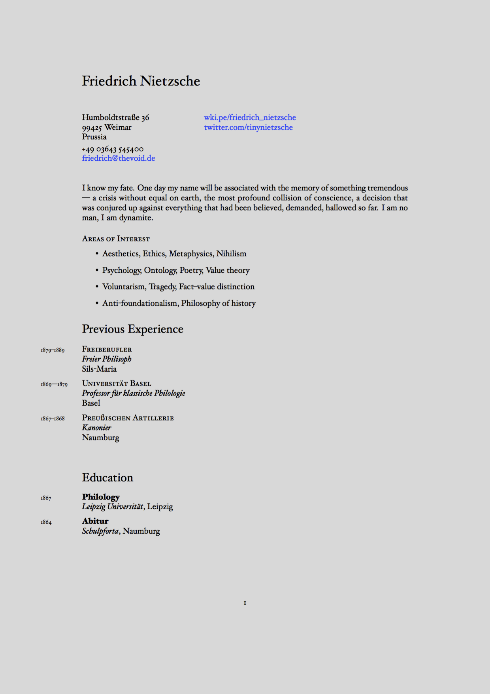

# CV Boilerplate

> I consider LaTeX resumes to be a secret handshake of sorts, something that makes me significantly more likely to be inclined to hire a candidate.  
> &mdash;<cite>[zackelan](https://news.ycombinator.com/item?id=10452606)<cite> on HN

A boilerplate to ease the pain of building and maintaining a CV or résumé using LaTeX.

## Intro

The separation of content from presentation is considered a universal best practice. The typical content of a CV is a perfect fit for a YAML file due to its structured nature:

```YAML
---
name: Friedrich Nietzsche
address:
- Humboldtstraße 36
- 99425 Weimar
- Prussia
email: friedrich@thevoid.de
# ...
experience:
- years: 1879--1889
  employer: Freiberufler
  job: Freier Philosoph
  city: Sils-Maria
- years: 1869–-1879
  employer: Universität Basel
  job: Professor für klassische Philologie
  city: Basel
```

That makes super easy to update a CV while keeping a consistent structure.

Thanks to [pandoc](http://pandoc.org/), we can then access our data from `template.tex` using a special notation. Iterating on repetitive data structures becomes trivial:

```latex
$for(experience)$
  $experience.years$\\
  \textsc{$experience.employer$}\\
  \emph{$experience.job$}\\
  $experience.city$\\[.2cm]
$endfor$
```

LaTeX takes then care of the typesetting with its usual elegance. Below a preview of the final result. Check out the [output](output.pdf) to see the compiled PDF.



With this method, you can keep your entire CV encoded in a single YAML file, put it under version control (into a gist, for instance), and generate a PDF on the fly when needed. You can also easily export it to other formats, like HTML for web publishing (I've heard [Jekyll](http://jekyllrb.com/) likes YAML). Convenient, portable and time-proof.

## Dependencies

1. LaTeX with the following extra packages: `fontspec` `geometry` `multicol` `xunicode` `xltxtra` `marginnote` `sectsty` `ulem` `hyperref` `polyglossia`
2. [Pandoc](http://pandoc.org/), the universal document converter.

I highly recommend [TinyTeX](https://yihui.org/tinytex/) as LaTeX distribution. All additional packages can be installed with `tlmgr` as needed.

## Getting started

1. Fill `details.yml` with your personal details, work experience, education, and desired settings.
2. Run `make` to compile the PDF.
3. Tweak on `template.tex` until you're satisfied with the result.

**Note**: this template needs to be compiled with XeTeX.

### Note for Windows users

Although I didn't test it, you can probably use this on Windows, too. Both [Pandoc](http://pandoc.org/installing.html) and LaTeX can be installed on Windows and you should be able to run makefiles on Windows through [Cygwin](https://www.cygwin.com/). If that's too much hassle, this command should do the trick in Powershell:

    pandoc details.yml -o output.pdf --template=template.tex --pdf-engine=xelatex

## Available settings

- **`mainfont`**: Hoefler Text is the default, but every font installed on your system should work out of the box thanks to XeTeX.
- **`fontsize`**: Possible values here are 10pt, 11pt and 12pt.
- **`lang`**: Sets the main language through the `polyglossia` package. This is important for proper hyphenation, among other things.
- **`geometry`**: A string that sets the margins through `geometry`. Read [this](https://www.sharelatex.com/learn/Page_size_and_margins) to learn how this package works.

## Recommended readings

- [Typesetting Automation](http://mrzool.cc/writing/typesetting-automation/), my article about this project with in-depth instructions and some suggestions for an ideal workflow.
- [Why I do my résumé in LaTeX](http://www.toofishes.net/blog/why-i-do-my-resume-latex/) by Dan McGee
- [What are the benefits of writing resumes in TeX/LaTeX?](http://tex.stackexchange.com/questions/11955/what-are-the-benefits-of-writing-resumes-in-tex-latex) on TeX Stack Exchange
- [Typesetting your academic CV in LaTeX](http://nitens.org/taraborelli/cvtex) by Dario Taraborelli
- [Résumé advices](http://practicaltypography.com/resumes.html) from Butterick's Practical Typography 
- [Multichannel Text Processing](https://ia.net/topics/multichannel-text-processing/) by iA
- [Why Microsoft Word must Die](http://www.antipope.org/charlie/blog-static/2013/10/why-microsoft-word-must-die.html) by Charlie Stross
- [Word Processors: Stupid and Inefficient](http://ricardo.ecn.wfu.edu/~cottrell/wp.html) by Allin Cottrell
- [Proprietary Binary Data Formats: Just Say No!](https://web.archive.org/web/20170730105025/http://www.podval.org/~sds/data.html) by Sam Steingold
- [Dimitrie Hoekstra](https://medium.com/@dimitrieh/a-curriculum-vitae-latex-typesetting-automation-adventure-with-gitlab-6ac233c0b66b#.v66feylcu) takes automation to the next level thanks to GitLab's continuous integration feats

## Resources

- [TinyTeX](https://yihui.org/tinytex/) is a lightweight, cross-platform, portable, and easy-to-maintain LaTeX distribution based on TeX Live.
- Refer to [pandoc's documentation](http://pandoc.org/MANUAL.html#templates) to learn more about how templates work.
- If you're not familiar with the YAML syntax, [here](http://learnxinyminutes.com/docs/yaml/)'s a good overview.
- If you want to edit the template but LaTeX scares you, these [docs](https://www.sharelatex.com/learn/Main_Page) put together by ShareLaTeX cover most of the basics and are surprisingly kind to the beginner.
- Odds are your question already has an answer on [TeX Stack Exchange](https://www.sharelatex.com/learn/Main_Page). Also, pretty friendly crowd in there.

## See also

- [invoice-boilerplate](https://github.com/mrzool/invoice-boilerplate) — Simple automated LaTeX invoicing system
- [letter-boilerplate](https://github.com/mrzool/letter-boilerplate) — Typeset your important letters without leaving your text editor

## License

This repository contains a modified version of Dario Taraborelli's [cvtex](https://github.com/dartar/cvtex) template.

License: [CC BY-SA 3.0](http://creativecommons.org/licenses/by-sa/3.0/)
